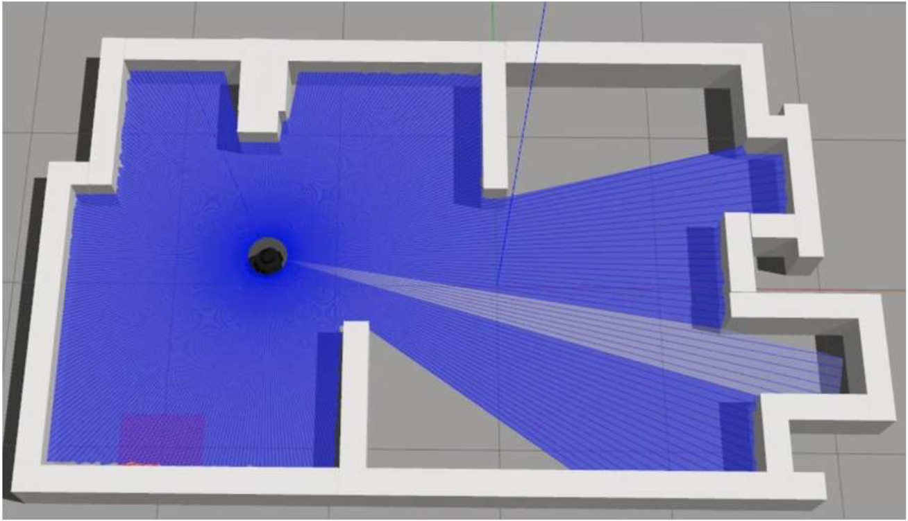
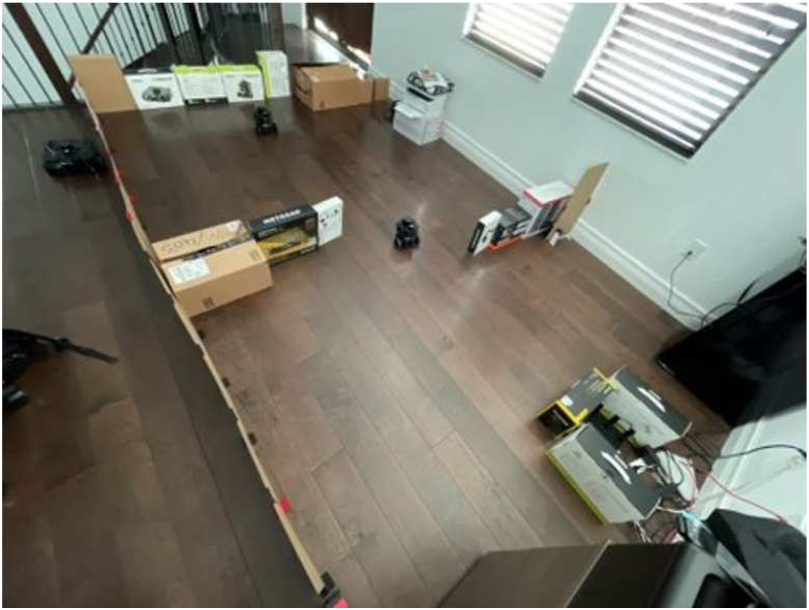
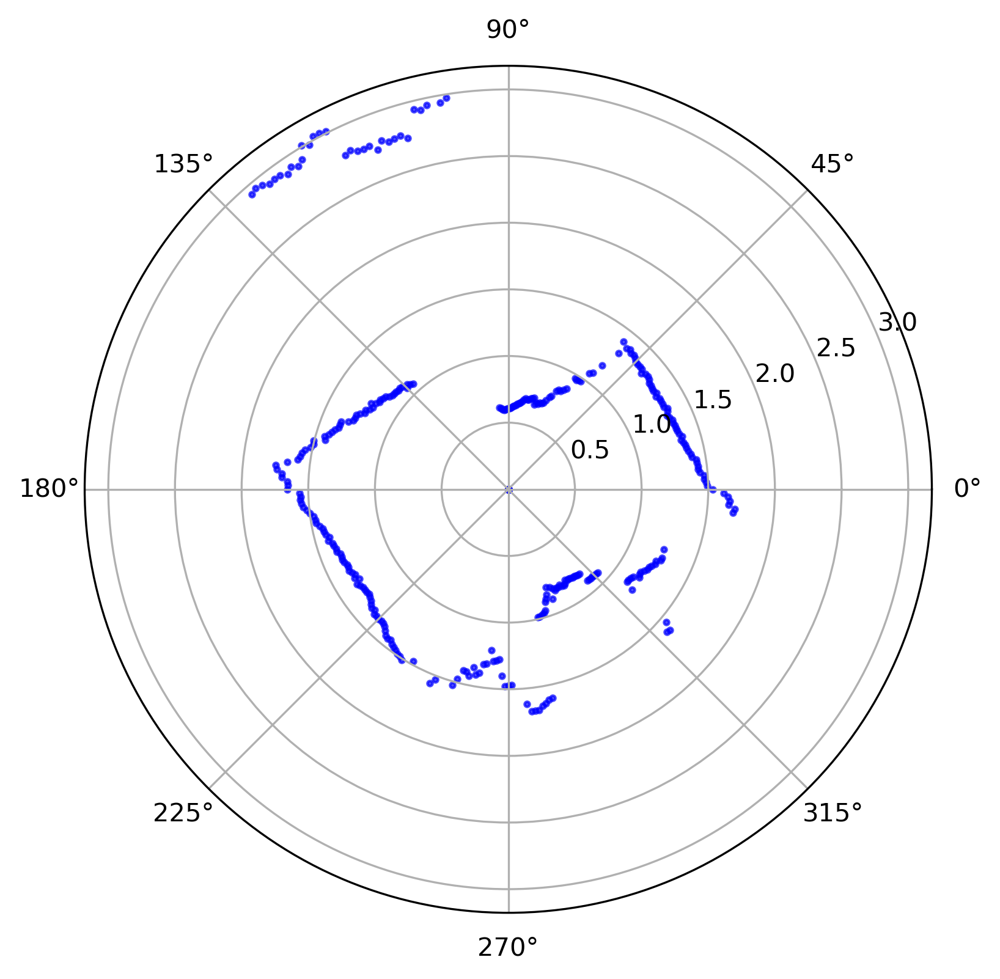
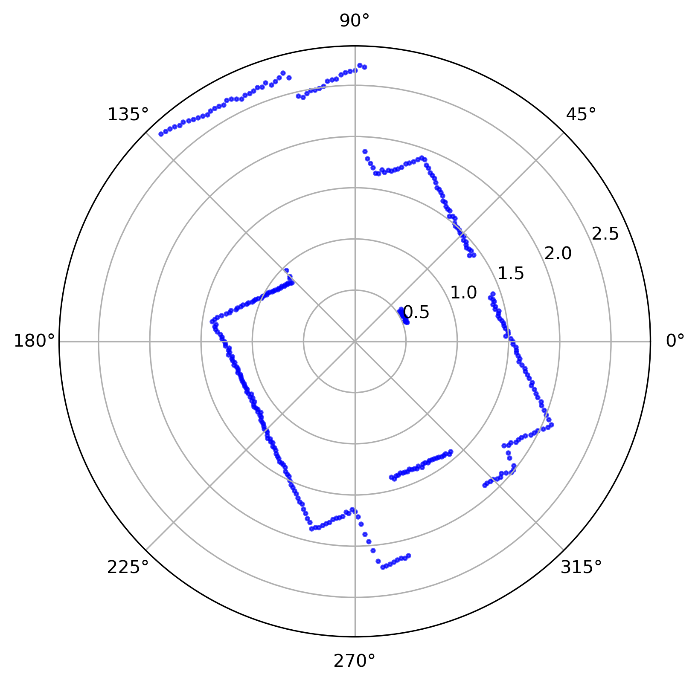
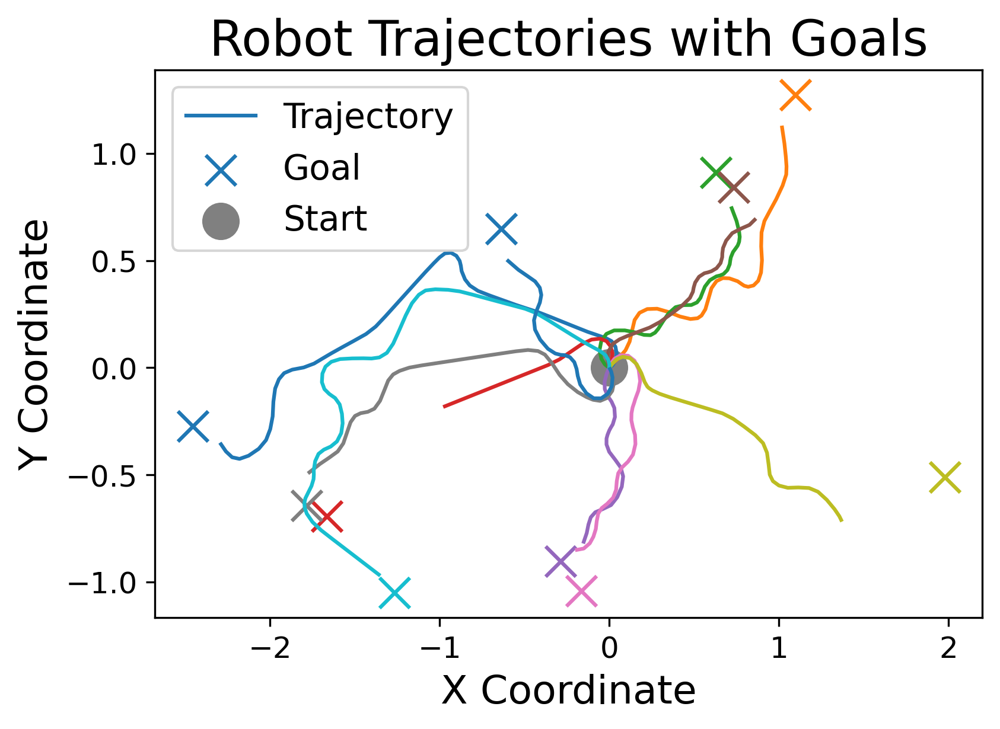
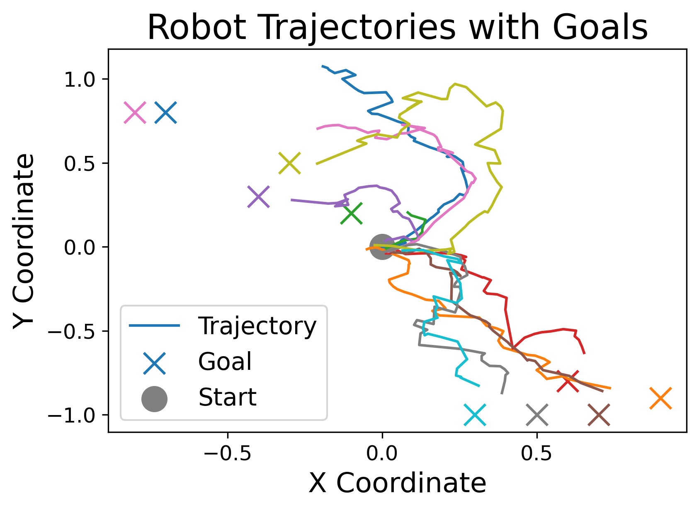

# P2Maze: A Protocol-Paired Sim-to-Real Robot Maze Navigation Dataset and Benchmark

P2Maze is an accessible, open-source **protocol-paired sim-to-real dataset and benchmark** for **mobile robot maze navigation** using the low-cost TurtleBot3 platform. It provides offline trajectories collected in both a **high-fidelity Gazebo simulation** and a **physically matched real-world maze** under a unified task specification, enabling reproducible research on distribution shift, zero-shot transfer, and data-efficient few-shot adaptation.

---

## Overview

Deploying learning-based navigation policies on real robots remains challenging due to:

- The **sim-to-real gap** between simulation and physical environments,
- Safety and cost constraints of large-scale robot interaction,
- Lack of standardized datasets supporting reproducible evaluation.

P2Maze addresses these challenges by providing:

- Protocol-aligned **simulation and real-world datasets**,
- Standardized benchmarking protocols,
- Reproducible evaluation splits and metrics,
- Baseline results covering common transfer settings.

The dataset and benchmark aim to lower the barrier for sim-to-real research in mobile robot navigation and support systematic evaluation of transfer methods.

---

## Visual Overview

### Environments: Simulation and Real Maze

  
  

The simulation and physical environments share the same maze layout and task specification, enabling protocol-paired data collection.

---

### LiDAR Reality Gap Example

  
  

Simulated LiDAR scans are clean and geometrically precise, while real scans exhibit sensor noise, artifacts, and measurement variance.

---

### Trajectory Comparison

  
  

Simulated trajectories are typically smoother, while real-world navigation reflects actuation imperfections and sensor noise.

---
### TODO

Code release is ongoing. The following items will be updated soon:

- [ ] Release pre-processed P2Maze dataset
- [ ] Add experiment code
- [ ] Add paper and poster link
